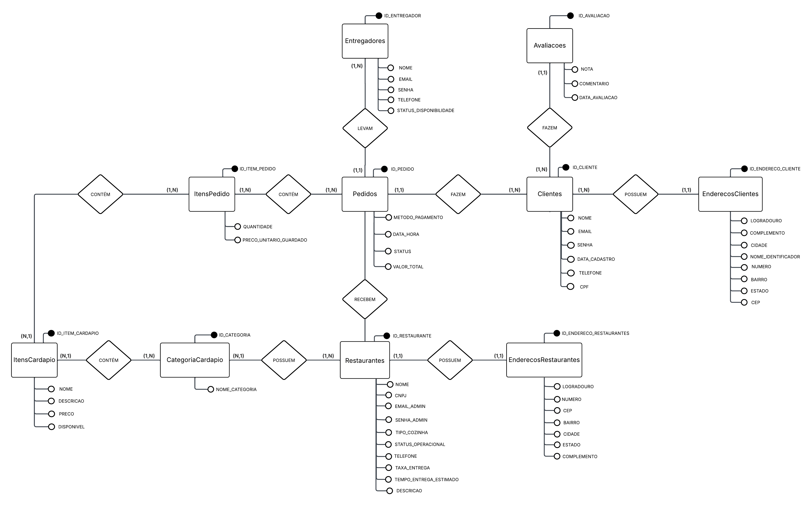
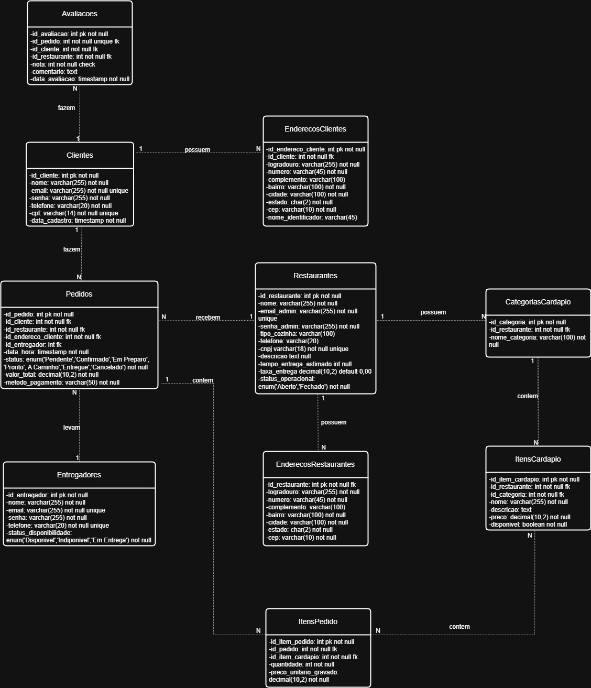

# 🍕 DeliverySystem

<div align="center">


**Sistema completo de delivery de comida com gestão de restaurantes, pedidos e entregas.**

[Funcionalidades](#-funcionalidades) •
[Tecnologias](#-tecnologias) •
[Instalação](#-instalação) •
[Configuração](#-configuração) •
[Uso](#-uso) •
[API](#-api) •
[Diagramas](#-diagramas) •
[Autores](#-autores)

</div>

---

## 📋 Sobre o Projeto

O **DeliverySystem** é uma aplicação full-stack que simula um sistema de delivery de comida, permitindo a interação entre três tipos de usuários:

- **Clientes**: Navegam por restaurantes, fazem pedidos e avaliam experiências
- **Restaurantes**: Gerenciam cardápios, processam pedidos e coordenam entregas
- **Entregadores**: Recebem e realizam entregas

## ✨ Funcionalidades

### 👤 Cliente
- [x] Cadastro e autenticação
- [x] Gerenciamento de múltiplos endereços
- [x] Navegação por restaurantes e cardápios
- [x] Carrinho de compras
- [x] Checkout com múltiplas formas de pagamento
- [x] Acompanhamento de pedidos em tempo real
- [x] Confirmação de entrega
- [x] Sistema de avaliações (1-5 estrelas + comentário)

### 🏪 Restaurante
- [x] Cadastro e autenticação próprios
- [x] Gerenciamento de perfil e endereço
- [x] CRUD de categorias do cardápio
- [x] CRUD de itens com controle de disponibilidade
- [x] Painel de pedidos com filtros e estatísticas
- [x] Fluxo de status de pedidos
- [x] Cadastro e gestão de entregadores
- [x] Atribuição de entregadores aos pedidos

### 🚴 Entregador
- [x] Portal dedicado
- [x] Visualização de entregas ativas
- [x] Atualização de status de entrega
- [x] Histórico de entregas

## 🛠 Tecnologias

### Backend
| Tecnologia | Versão | Descrição |
|------------|--------|-----------|
| Node.js | 18+ | Runtime JavaScript |
| Express | 5.x | Framework web |
| MySQL2 | 3.x | Driver MySQL |
| JWT | 9.x | Autenticação |
| Bcrypt.js | 3.x | Criptografia de senhas |
| Express-validator | 7.x | Validação de dados |
| Helmet | 8.x | Segurança HTTP |
| Cors | 2.x | Cross-Origin Resource Sharing |
| Morgan | 1.x | Logger HTTP |

### Frontend
| Tecnologia | Versão | Descrição |
|------------|--------|-----------|
| React | 19.x | Biblioteca UI |
| Vite | 7.x | Build tool |
| React Router | 7.x | Roteamento SPA |
| Axios | 1.x | Cliente HTTP |

## 📁 Estrutura do Projeto

```
DeliverySystem/
├── backend/
│   ├── config/          # Configuração do banco de dados
│   ├── controllers/     # Controladores das rotas
│   ├── middlewares/     # Middlewares (auth, validation, error)
│   ├── models/          # Modelos de dados
│   ├── repositories/    # Camada de acesso a dados
│   ├── routes/          # Definição das rotas
│   ├── services/        # Lógica de negócio
│   ├── validators/      # Schemas de validação
│   ├── server.js        # Entry point
│   └── package.json
│
├── frontend/
│   ├── src/
│   │   ├── components/  # Componentes reutilizáveis
│   │   ├── context/     # Context API (Auth, Cart, Toast)
│   │   ├── hooks/       # Custom hooks
│   │   ├── pages/       # Páginas da aplicação
│   │   ├── services/    # Serviços de API
│   │   ├── utils/       # Funções utilitárias
│   │   └── App.jsx      # Componente raiz
│   └── package.json
│
└── database/
    ├── schema.sql       # DDL do banco de dados
    └── seed.sql         # Dados de teste
```

## 🚀 Instalação

### Pré-requisitos

- [Node.js](https://nodejs.org/) (v18 ou superior)
- [MySQL](https://www.mysql.com/) (v8 ou superior)
- [Git](https://git-scm.com/)

### Clone o repositório

```bash
git clone https://github.com/Shizuo0/DeliverySystem.git
cd DeliverySystem
```

### Instale as dependências

```bash
# Backend
cd backend
npm install

# Frontend
cd ../frontend
npm install
```

### Configure o banco de dados

1. Crie o banco de dados executando o script SQL:

```bash
mysql -u root -p < database/schema.sql
```

2. (Opcional) Popule com dados de teste:

```bash
mysql -u root -p delivery_db < database/seed.sql
```

## ⚙ Configuração

### Backend (`backend/.env`)

Crie o arquivo `.env` baseado no `.env.example`:

```env
# Database
DB_HOST=localhost
DB_USER=root
DB_PASSWORD=sua_senha
DB_NAME=delivery_db
DB_PORT=3306

# Server
PORT=3000
NODE_ENV=development

# JWT
JWT_SECRET=sua_chave_secreta_aqui
JWT_EXPIRES_IN=24h

# CORS
FRONTEND_URL=http://localhost:5173
```

### Frontend (`frontend/.env`)

```env
VITE_API_URL=http://localhost:3000/api
```

## 🎮 Uso

### Iniciar o sistema

**Terminal 1 - Backend:**
```bash
cd backend
npm run dev
```

**Terminal 2 - Frontend:**
```bash
cd frontend
npm run dev
```

### Acessar a aplicação

- **Frontend**: http://localhost:5173
- **API**: http://localhost:3000/api
- **Health Check**: http://localhost:3000/api/health

### Scripts disponíveis

| Comando | Descrição |
|---------|-----------|
| `npm run dev` | Inicia em modo desenvolvimento (hot reload) |
| `npm start` | Inicia em modo produção |
| `npm run test:db` | Testa conexão com o banco (backend) |
| `npm run build` | Gera build de produção (frontend) |
| `npm run preview` | Preview do build (frontend) |

## 📡 API

### Autenticação

Todas as rotas protegidas requerem o header:
```
Authorization: Bearer <token>
```

### Endpoints principais

<details>
<summary><strong>🔐 Auth</strong></summary>

| Método | Rota | Descrição |
|--------|------|-----------|
| POST | `/api/auth/register` | Cadastro de cliente |
| POST | `/api/auth/login` | Login de cliente |

</details>

<details>
<summary><strong>👤 Clientes</strong></summary>

| Método | Rota | Descrição |
|--------|------|-----------|
| GET | `/api/clientes/profile` | Obter perfil |
| PUT | `/api/clientes/profile` | Atualizar perfil |
| GET | `/api/clientes/enderecos` | Listar endereços |
| POST | `/api/clientes/enderecos` | Criar endereço |
| PUT | `/api/clientes/enderecos/:id` | Atualizar endereço |
| DELETE | `/api/clientes/enderecos/:id` | Excluir endereço |

</details>

<details>
<summary><strong>🏪 Restaurantes</strong></summary>

| Método | Rota | Descrição |
|--------|------|-----------|
| GET | `/api/restaurantes` | Listar todos |
| GET | `/api/restaurantes/abertos` | Listar abertos |
| GET | `/api/restaurantes/:id` | Obter detalhes |
| GET | `/api/restaurantes/:id/cardapio` | Obter cardápio |
| POST | `/api/restaurantes/register` | Cadastro |
| POST | `/api/restaurantes/login` | Login |
| PUT | `/api/restaurantes/perfil` | Atualizar perfil |
| PUT | `/api/restaurantes/status` | Abrir/Fechar |
| POST | `/api/restaurantes/categorias` | Criar categoria |
| POST | `/api/restaurantes/menu/itens` | Criar item |

</details>

<details>
<summary><strong>📦 Pedidos</strong></summary>

| Método | Rota | Descrição |
|--------|------|-----------|
| POST | `/api/pedidos/cliente` | Criar pedido |
| GET | `/api/pedidos/cliente` | Listar pedidos (cliente) |
| GET | `/api/pedidos/cliente/:id` | Detalhes do pedido |
| PUT | `/api/pedidos/cliente/:id/cancelar` | Cancelar pedido |
| PUT | `/api/pedidos/cliente/:id/entregue` | Confirmar entrega |
| GET | `/api/pedidos/restaurante` | Listar pedidos (restaurante) |
| PUT | `/api/pedidos/restaurante/:id/status` | Atualizar status |
| PUT | `/api/pedidos/restaurante/:id/entregador` | Atribuir entregador |

</details>

<details>
<summary><strong>🚴 Entregadores</strong></summary>

| Método | Rota | Descrição |
|--------|------|-----------|
| GET | `/api/entregadores` | Listar todos |
| POST | `/api/entregadores` | Criar entregador |
| PUT | `/api/entregadores/:id` | Atualizar |
| PUT | `/api/entregadores/:id/status` | Atualizar status |
| DELETE | `/api/entregadores/:id` | Excluir |

</details>

<details>
<summary><strong>⭐ Avaliações</strong></summary>

| Método | Rota | Descrição |
|--------|------|-----------|
| POST | `/api/avaliacoes/cliente` | Criar avaliação |
| GET | `/api/avaliacoes/cliente` | Minhas avaliações |
| GET | `/api/avaliacoes/restaurante/:id` | Avaliações do restaurante |

</details>

## 📊 Diagramas

### Diagrama Conceitual (Entidade-Relacionamento)

O diagrama conceitual apresenta as entidades do sistema e seus relacionamentos de forma abstrata, sem detalhes de implementação.



### Diagrama de Classes

O diagrama de classes mostra a estrutura do sistema com atributos, tipos de dados e cardinalidades dos relacionamentos.



## 🔒 Segurança

- Senhas criptografadas com bcrypt
- Autenticação via JWT com expiração
- Validação de dados em todas as rotas
- Proteção CORS configurável
- Headers de segurança via Helmet
- Sanitização de inputs

## 🐛 Troubleshooting

<details>
<summary><strong>Erro de autenticação MySQL</strong></summary>

```sql
ALTER USER 'root'@'localhost' IDENTIFIED WITH mysql_native_password BY 'sua_senha';
FLUSH PRIVILEGES;
```
</details>

<details>
<summary><strong>Porta em uso</strong></summary>

Altere a porta no `.env` ou encerre o processo:
```bash
# Linux/Mac
lsof -i :3000
kill -9 <PID>

# Windows
netstat -ano | findstr :3000
taskkill /PID <PID> /F
```
</details>

<details>
<summary><strong>CORS Error</strong></summary>

Verifique se `FRONTEND_URL` no backend `.env` corresponde à URL do frontend.
</details>

## 📄 Licença

Este projeto está sob a licença MIT. Veja o arquivo [LICENSE](LICENSE) para mais detalhes.

## 👥 Autores

<table>
  <tr>
    <td align="center">
      <a href="https://github.com/Shizuo0">
        
        <br />
        <sub><b>Paulo Shizuo Vasconcelos Tatibana</b></sub>
      </a>
    </td>
    <td align="center">
      <a href="https://github.com/gigio-mm">
        
        <br />
        <sub><b>Gigio Moura Melo</b></sub>
      </a>
    </td>
  </tr>
</table>

---

<div align="center">

Feito para a disciplina de Banco de Dados
</div>
